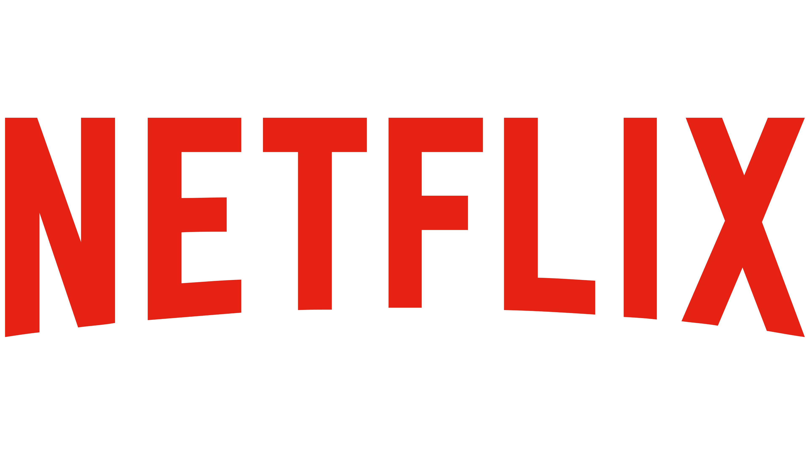

<h1 align="center">Netflix: Clone with Angular</h1>

<p align="center">
  
  <br />
  A Netflix clone made with Angular, in TypeScript, and The Movie Database (TMDB) API.
  <br />
  <a href="https://stantanasi.github.io/netflix-angular">
    <strong>Visit Website »</strong>
  </a>
  <br />
  <br />
  <a href="https://github.com/stantanasi/netflix-angular/issues">Report Bug</a>
  ·
  <a href="https://github.com/stantanasi/netflix-angular/issues">Request Feature</a>
</p>

<details>
  <summary>Table of Contents</summary>

  * [About the project](#about-the-project)
    * [Built with](#built-with)
  * [Getting started](#getting-started)
    * [Prerequisites](#prerequisites)
    * [Setup](#setup)
  * [Development](#development)
  * [Contributing](#contributing)
  * [Author](#author)
  * [License](#license)
</details>

## About the project

<p align="center">
  
</p>

This project was generated with [Angular CLI](https://github.com/angular/angular-cli).

A Netflix clone made with Angular, in TypeScript. It uses The Movie Database (TMDB) API to get popular Movies and TV Shows and display their details.

### Built with

- [Angular](https://angular.io)
- [The Movie Database (TMDB) API](https://themoviedb.org)


## Getting started

### Prerequisites

Install [Node.js](https://nodejs.org) which includes [Node Package Manager](https://www.npmjs.com/get-npm)

Install the [Angular CLI](https://www.npmjs.com/package/@angular/cli) globally:
```bash
npm install -g @angular/cli
```

### Setup

1. Clone the project to your local machine

```bash
git clone https://github.com/stantanasi/netflix-angular.git
cd netflix-angular
```

2. Install the packages required

```bash
npm install
```

## Development

Run development server

```bash
ng serve --open
```

Navigate to `http://localhost:4200`. The app will automatically reload if you change any of the source files.

## Contributing

Contributions are what make the open source community such an amazing place to be learn, inspire, and create. Any contributions you make are **greatly appreciated**.

1. Fork the project
2. Create your feature branch (`git checkout -b feature/amazing-feature`)
3. Commit your changes (`git commit -m 'Add some amazing feature'`)
4. Push to the branch (`git push origin feature/amazing-feature`)
5. Open a pull request

## Author

- [Lory-Stan TANASI](https://github.com/stantanasi)

## License

This project is licensed under the `Apache-2.0` License - see the [LICENSE](LICENSE) file for details

<p align="center">
  <br />
  © 2021 Lory-Stan TANASI. All rights reserved
</p>
