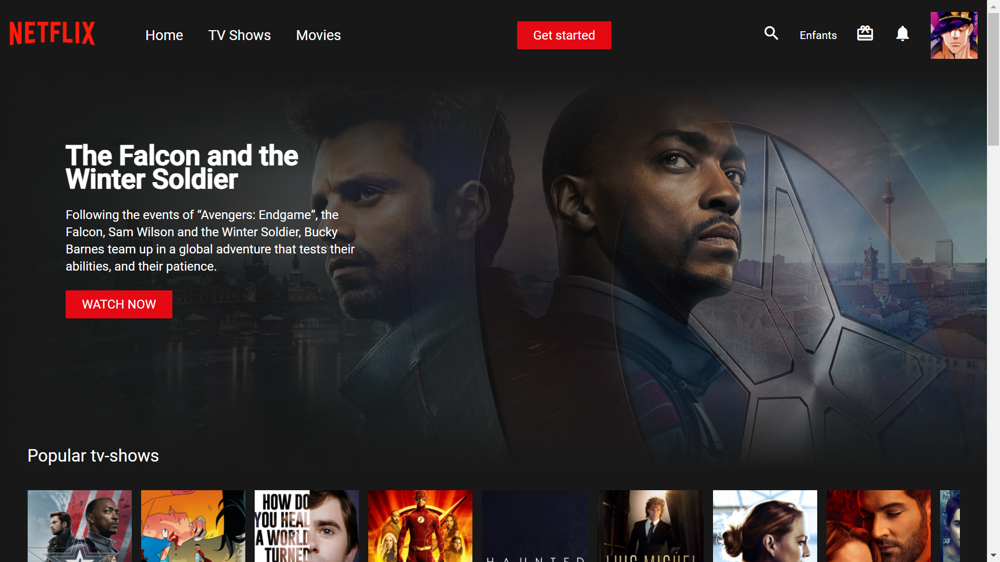

<h1 align="center">Netflix: Clone with Angular</h1>

<p align="center">
  A Netflix clone made with Angular, in TypeScript, and The Movie Database (TMDB) API.
</p>

<p align="center">
  <a href="https://stantanasi.github.io/netflix-angular">Netflix clone - Live Demo</a>
</p>



## Getting started

### Prerequisites

- Install [Node.js](https://nodejs.org) which includes [Node Package Manager](https://www.npmjs.com/get-npm)


### Clone the project to your local machine

```bash
git clone https://github.com/stantanasi/netflix-angular.git
cd netflix-angular
```

### Install the packages required

```bash
npm install
```

### Run the application

```bash
ng serve --open
```

## Author

- Lory-Stan TANASI

## License

This project is licensed under the Apache-2.0 License - see the [LICENSE](LICENSE) file for details

<p align="center">
  <br />
  © 2021 Lory-Stan TANASI. All rights reserved
</p>